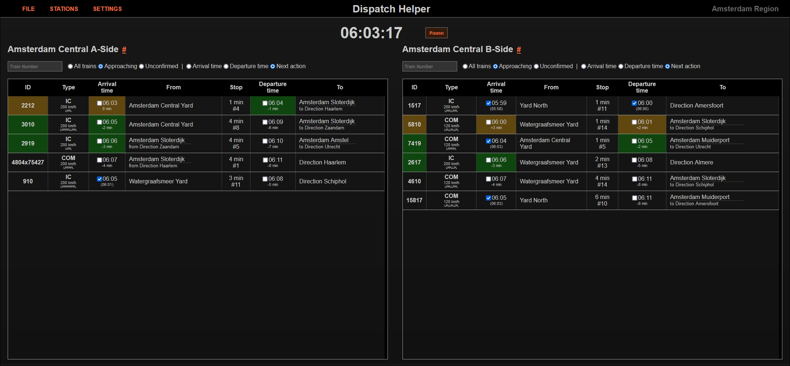

Dispatch Helper
===============

A timetable viewer and dispatch tracking system for the game [Rail Route](https://railroute.eu).
Created as a weekend project.

[https://dispatch.thewolf.sh](https://dispatch.thewolf.sh)

Usage
-----

Load a map either from a file, or paste it in plaintext. Every map is processed in your browser only.
You can save the map locally, and then load it in other tabs as well.

Select one or more stations to view the timetable. Mark train arrivals and departures to track the active trains. Trains are highlighted if they are expected to depart or arrive soon.

You can filter out trains that are too far away (customize the filter period in the settings). You can also filter trains that you have already dispatched (departed or passed-through). For sorting the timetable, Next Action tracks the departure time if the train has already arrived.

If you have saved a game, you can sync the timer and the savegame across multiple tabs. (Arrival/departure tracking is not synced yet.) If the game is paused, click the timer to change it, and press Enter to apply across tabs.

Building
--------

You can open the page locally as well, if you don't want to go to the website every time.

If you want to contribute, be aware that this was a couple-hour weekend project, so it's definitely not designed to be maintainable! :D Other than that, it's pure Javascript and HTML5, no build system or webpack or anything fancy. Feel free to open PRs and issues!

License
-------

Copyright (c) 2023 Discookie. Released under the BSD 3-clause license.
